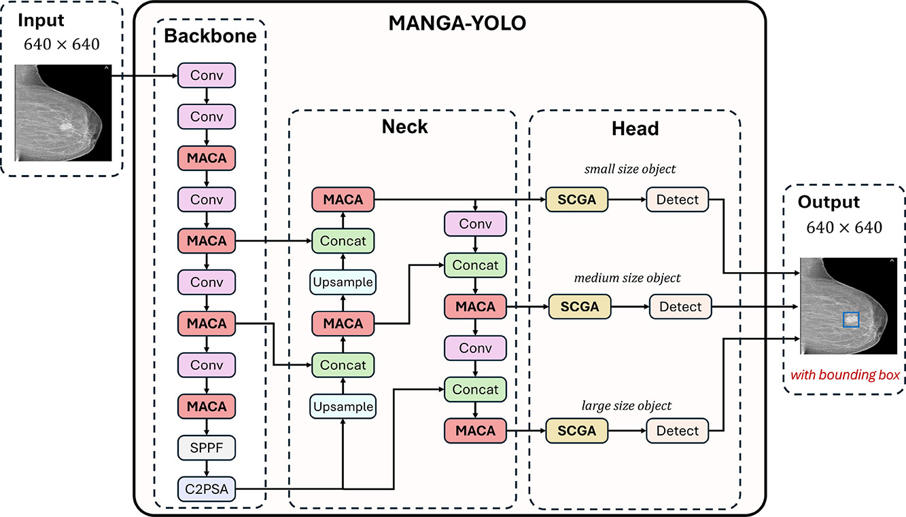

## MANGA-YOLO: A Mamba-Inspired YOLO Model with Group Attention for Breast Mass Detection in Mammograms

#### Official repository of **MANGA-YOLO**. Full paper can be accessed **[Here](https://doi.org/10.1016/j.compbiomed.2025.111339)**

### 🔎 Abstract
> Breast cancer continues to be the primary cause of mortality from cancer in women globally, highlighting the urgent necessity for early and accurate identification. Although mammogram is the gold standard for screening, several challenges still exist, such as low contrast, varying sizes of masses, and irregular mass shapes. To address these limitations, we propose MANGA-YOLO, a novel learning model for breast mass detection inspired by the Mamba and transformer architecture. Our model integrates Mamba-Inspired Attention with Contextual Awareness (MACA) to improve feature extraction by capturing long-range dependencies and enhancing contextual understanding. Additionally, we introduce a Spatial and Channel Group Attention (SCGA) module, which combines convolutional spatial refinement with group self-attention. This enriches feature representation by strengthening boundary sensitivity and emphasizing global information through a series of attention modules, thus improving the detection of masses with diverse sizes. These improvements enable more precise detection of small, low-contrast, and irregularly shaped masses. The proposed approach is evaluated on three mammography datasets - INbreast, VinDr-Mammo, and CBIS-DDSM - achieving 0.881, 0.69, and 0.664 for mAP50 metric, respectively. The results show the outperformance of our method over existing state-of-the-art models. It suggests that MANGA-YOLO offers a more robust and efficient approach to automated breast mass detection, potentially improving early diagnosis and clinical decision making. 



### ✨ Key Contributions

- **MACA**: Mamba-Inspired Attention with Contextual Awareness to capture long-range dependencies and strengthen contextual feature extraction.
- **SCGA**: Spatial & Channel Group Attention combining convolutional spatial refinement with group self-attention to improve boundary sensitivity and multi-scale detection.
- Extensive evaluation on **three mammography datasets** (INbreast, VinDr-Mammo, CBIS-DDSM) with competitive performance.


### 📊 Results (mAP@0.5)

| Dataset       | Metric  | Score |
|--------------|---------|-------|
| INbreast      | mAP50   | 0.881 |
| VinDr-Mammo   | mAP50   | 0.690 |
| CBIS-DDSM     | mAP50   | 0.664 |

> Notes:
> - The numbers above are reported in the paper.
> - Please refer to the paper for more metrics comparisons,experimental settings, and evaluation protocol.

### 🗂️ Datasets

This project evaluates on three public mammography datasets:

- **INbreast**
- **VinDr-Mammo**
- **CBIS-DDSM**

⚠️ The datasets can be obtained through their official channels and comply with their licenses/terms.


### 🙏 Acknowledgements

- YOLO family of detectors

- Mamba-inspired sequence modeling ideas

- Public mammography datasets used for benchmarking

### 📚 Citation

If you use this work, please cite:
> BibTeX Format</br>
```
@article{Trang2025MANGAYOLO,
  title   = {MANGA-YOLO: A Mamba-inspired YOLO model with group attention for breast mass detection in mammograms},
  author  = {Trang, Kien and Ting, Fung Fung and Vuong, Bao Quoc and Ting, Chee-Ming},
  journal = {Computers in Biology and Medicine},
  year    = {2025},
  volume  = {199},
  pages   = {111339},
  doi     = {10.1016/j.compbiomed.2025.111339},
  pmid    = {41308237}
}
```

---
